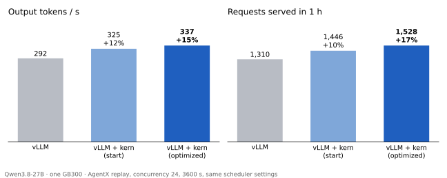

# An optimization loop on vLLM + kern: Qwen3.8-27B

## Summary

[vllm.md](vllm.md) runs a kern manifest as the model inside vLLM and sketches
a loop that improves it from live traffic. This note is that loop, run for one
night (2026-09-25 → 26) on Qwen3.8-27B, one GB300.

Every round does the same thing. vLLM serves an hour of agent traffic, and
the step shapes it scheduled become a kern bench workload. Three agents spend
two hours each on the most expensive ops. What passes the gate is merged and
served in the next hour. Three rounds ran, and then the loop was stopped by
hand once round 3's agents were finding about 0.1% each.



Side by side, with the same vLLM, scheduler limits and traffic:

- **Against stock vLLM**, the optimized manifest served **17% more requests**
  and 15% more output tokens per second, at 27% lower inter-token latency.
- **Against kern's own starting manifest**, the loop cut the GPU time of the
  same traffic by **5.3%** (+5.7% requests online).

The page [kern-baa.pages.dev/rsi](https://kern-baa.pages.dev/rsi/) plots every
measurement the agents took over the night.

## Why the bench stands for production

The loop never optimizes against a synthetic benchmark. Its benchmark is the
served hour, re-sampled every round:

- **The shapes are vLLM's.** The plugin logs every step exactly as vLLM
  scheduled it, including chunked prefill mixed with decode, and batch sizes set
  by real arrivals. A round's workload is those steps counted into buckets.
- **The prices are kern's.** `kern bench` runs the served manifest itself on
  each bucket's shape, with real weights and real context lengths, and
  multiplies by the count. The result is GPU seconds for the hour.
- **It adds up.** On a 5-minute check the bench accounted for 294 of the
  308 s the GPU was busy (the rest is vLLM on the CPU). After round 2 the
  bench predicted −3.1% and the next hour's ITL p50 moved −4.8%.
- **It is stable across traces.** Scoring every deployed manifest on round 3's
  trace reproduces each round's gate result within 0.05 points (table in
  [Results](#results)).
- **It guards what the trace misses.** The traced hour never exceeded 24
  sequences, but the server admits 128. The gate times every admitted batch
  size, because round 1 produced a gemm that won the trace by 2.7% and was 38%
  slower at 128 sequences.

## How the loop turns


A round takes about 3.5 hours, most of it the two fixed windows:

| phase | what happens | time |
|---|---|---|
| serve | vLLM + kern on GPU 0, one hour of AgentX replay (concurrency 24), trace on | 60 min |
| bench | trace → workload → `kern bench` on GPU 0; baselines on GPUs 1–3 in parallel | 8 min |
| dispatch | rank ops, pick three targets, write each a sub-bench and a brief | 8 min |
| agents | one Claude Code session loop per target, one GPU each | 120 min |
| gate | each run and their merge scored against main on the same GPU | 11 min |
| deploy | merge, regenerate the served manifest, restart | 5 min |

An orchestrator agent drives the phases from a 10-minute cron. It also owns the
harness: most of what improved over the night was the loop itself (see
[What the loop learned](#what-the-loop-learned)).

### 1. Serve and trace

With `KERN_TRACE=<dir>` the plugin writes one JSON line per step: query
length and sequence length per request.

```json
{"t":1790388882823487775,"q":[1,1,1,1,1,1,1,1],"s":[196295,165202,140890,120581,208896,105929,107300,110164]}
{"t":1790388763610411037,"q":[1,1,1,1,1,37],"s":[87241,158337,81169,101181,516,114853]}
```

The first line is a decode step over eight sequences of 100–210k tokens. The
second is a mixed step: five decode rows, plus a 37-token prefill on top of a
115k-token cached prefix.

This shows the step mix of round 3's hour:

```bash
jq -r 'if (.q|max)==1 then "decode" elif (.q|length)==1 then "prefill" else "mixed" end' trace.jsonl | sort | uniq -c
```
```
 160322 decode
   3474 mixed
    435 prefill
```

This shows how many sequences a decode step carries. It is almost always 5–9:
agent sessions spend most of their time in tool calls, not in the model.

```bash
jq -r 'select((.q|max)==1) | .q|length' trace.jsonl | sort -n | uniq -c | sort -rn | head -3
```
```
  26016 6
  25333 7
  21502 8
```

### 2. From trace to benchmark

`python -m kern_vllm.workload <trace>` buckets the steps by program, sequences,
rows and context, and writes a weighted `kern bench` workload:

```toml
# 167843 calls in 200 buckets
samples = 16
seed = 0

[[sweep]]
groups = [16]
rows = [1]
context = [131072]
weight = 39226
```

`kern bench --workload` prices it. Every sequence copies its context from one
real prefix, so a 131k-token bucket is 131k tokens of real KV:

```
source    256371 tokens of real prefix per rank   16.5s
plan      206 scenarios · 0 dropped · 3222976 tokens of state · 17 seqs
cost      4169.656 s · 167843 calls · attn_batch 43.3% · gemm_gate_up_silu 14.4% · gemm_n5120_norm 12.9% · gemm 9.3% · ...
```

That `cost` line is the round's number: GPU seconds for the traced hour, on
the manifest being served. Lower is better.

### 3. Dispatch

A per-op breakdown overstates small ops, because each call pays timing
overhead. `kern bench --ablate` times each program once more with one op left
out, so `free` is what removing that op would save:

```
scenario  decode_batch-g16-r1-kv131072
mix       attn_batch 62.6% · gemm_gate_up_silu 13.7% · gemm_n5120_norm 12.4% · gemm_in_proj 5.0% · gdn_step 3.8% · ...
free      attn_batch 67.6% · gemm_gate_up_silu 11.8% · gemm_n5120_norm 10.0% · gdn_step 4.1% · gemm_in_proj 3.9% · ...
```

The orchestrator then checks each candidate against its roofline (bytes per
call over 7.04 TB/s for decode), skips what is already there (attn_batch sat at
~98% of its KV bytes from the start), and splits the rest along kernel
boundaries. Each run gets:

- **A sub-bench.** The few buckets that carry its ops, with baselines measured
  on its own GPU, so a score also prints the projected full-workload change:
  ```toml
  # gemm_gate_up_silu: 3 buckets, 72% of its weighted time (431.851 s), 3887184 prefix tokens
  # baseline = 2490.681
  # full = 4172.243
  ```
- **A brief.** The target, its headroom, the shapes that matter, what earlier
  rounds tried, and which neighbouring kernel belongs to another run.

### 4. Agents

Each agent works in its own git worktree of the model repo and may change only
the base manifest and kernels. The runtime, plugin and scripts are frozen. The
inner loop is edit, `nvcc`, check, sub-bench, and takes under five minutes.
The check must print `PASS` twice before a commit (a pre-commit hook enforces
it):

```
PASS      logit evidence: end-to-end KL ≤ 2.31e-4 (limit 1e-2) on 22 rows, argmax agrees   15.9s
PASS  no allowed decode shape is >2% slower than main
```

The first line is `kern test`: logits of the whole model against main's. The
second is the guard over batch sizes 1–128. Messages from the orchestrator go
to the top of each agent's brief. Agents in round 1 missed the guard when it
was appended at the bottom instead.

### 5. Gate and deploy

Each run is scored on the full workload on the GPU it used, against main on
that same GPU (GPUs differ by ~0.1%). A run ships at −1% or better with both
checks passing. Runs that each fall short can ship together, if their merge
clears the bar:

```
gemm    eligible   main=4044.572 run=4002.841 delta=-1.03% check=PASS guard=PASS
gateup  ineligible main=4045.431 run=4013.257 delta=-0.80% check=PASS guard=PASS
merge   eligible   main=4042.300 run=3991.199 delta=-1.26% check=PASS guard=PASS
```

Manifest conflicts between runs are resolved structurally, key by key and
call by call, never as text. The merged base manifest is regenerated into the
served one, and the server restarts on it for the next hour.

## Results

### Three servers, one hour

Same vLLM (`e97573215`) and scheduler limits (max-model-len 262144,
max-num-seqs 128, max-num-batched-tokens 8192, prefix caching). One GB300
each, all three at once, AgentX replay at concurrency 24 for 3600 s with the
same seed. Stock vLLM runs its defaults (torch.compile, full and piecewise
graphs).

| | vLLM | vLLM + kern, start | vLLM + kern, optimized |
|---|---|---|---|
| requests in 1 h | 1310 | 1446 | **1528** |
| output tok/s | 291.6 | 325.4 | **336.5** |
| ITL p50 / p99 ms | 30.0 / **62.1** | 23.6 / 78.6 | **21.9** / 75.1 |
| TTFT p50 / p99 ms | **413 / 9417** | 437 / 10860 | 422 / 10481 |
| prompt-cache hit | 93.2% | 93.4% | 93.4% |

Stock vLLM keeps the better tails, likely because kern runs only pure decode
steps in CUDA graphs: steps that mix prefill and decode run eagerly. Not yet
profiled.

### What shipped

Each deployed manifest was scored on round 3's workload on one GPU:

| step | GPU s | change | total |
|---|---|---|---|
| start | 4405.9 | | |
| round 1: GDN conv folded into the decode step, faster prefill chunk ops, small decode ops | 4306.0 | −2.27% | −2.27% |
| split-K decode gemms, routed to ≤ 16 rows by the manifest's `when` | 4226.1 | −1.85% | −4.08% |
| round 2: residual + norm in the down-proj epilogue, gate_up / in_proj, prefill chunk and row ops | 4173.4 | −1.25% | **−5.28%** |

Round 3 was stopped with each run near −0.1%. By then bf16 decode was at 85–98%
of its memory-bandwidth floor per op. The remaining levers change what a step
reads, like fewer bytes per weight or more tokens per read, and were left out
of this run.

## What the loop learned

Most changes over the night were to the harness, each prompted by something
an agent did:

- **The guard.** A kernel tuned on the trace regressed the batch sizes the
  trace never reached. The gate now times every admitted batch size.
- **Row-count routing.** That kernel was still right for ≤ 16 rows. A manifest
  launch can now carry `when: {var, min, max}`, so it shipped for small batches
  and cuBLASLt kept the rest.
- **`--ablate`.** Per-call timing inflated small ops' shares about twofold and
  sent agents after the wrong ops.
- **Merges don't add.** Two runs on neighbouring ops won −0.95% and −0.66% and
  merged to −1.11%. The orchestrator now trial-merges mid-round and draws runs
  along kernel boundaries.
- **Loop speed.** Serve end to agents up went from 35 to 15 minutes. Baselines
  run in parallel, the gate reuses them, and a full bench dropped from 23 to
  7.5 minutes once sequences copy one real prefix.
- **Stated costs.** Agents stopped 8–16 minutes early, believing a cycle took
  longer than it does. The brief now states the cycle time.

## Limits

- One GPU per server, one model, one traffic source (AgentX replay).
- The orchestrator is itself an agent. A human set the budget, stopped the
  loop and ruled out quantization.
- The bench prices the forward pass only. Scheduling changes (chunk size,
  prefix-cache retention, host offload of evicted prefixes) move the shapes
  themselves and need an end-to-end objective. 2.1% of prompt tokens missed
  the cache avoidably in round 3, mostly idle agents' GDN state evicted under
  KV pressure.
