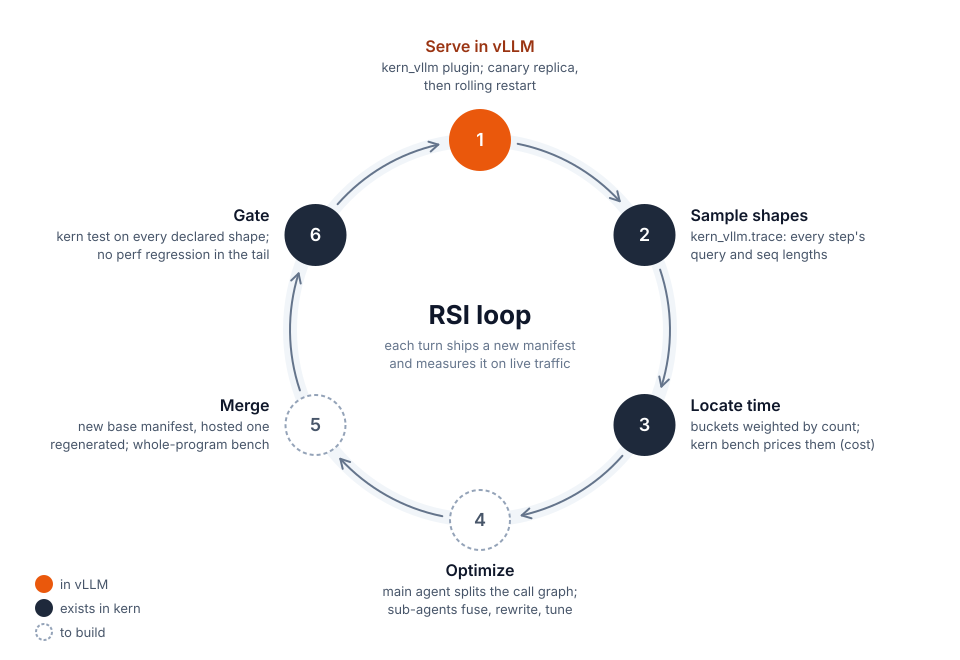

# Running a kern manifest as a vLLM model

## Summary

A kern manifest can now run as the model inside an unmodified vLLM (MRv2),
loaded through a plugin. vLLM keeps everything outside the forward pass:
scheduling, the KV cache and its block pool, CUDA graphs, sampling, the API
and the profiler endpoint. kern runs the forward pass on memory that vLLM
allocates.

```bash
(cd crates/kern-py && maturin build --release) && pip install target/wheels/kern-*.whl
pip install python/kern_vllm
hf download Pegainfer/kern-qwen38-sm103 --local-dir kern-qwen38
KERN_MANIFEST=kern-qwen38/manifests/qwen3.8-27b-vllm.json KERN_KERNELS=kern-qwen38/cubins \
vllm serve Qwen/Qwen3.8-27B --hf-overrides '{"architectures": ["KernForCausalLM"]}' \
  --max-num-seqs 128 --max-num-batched-tokens 8192 --enable-prefix-caching \
  -cc '{"mode": 0, "cudagraph_mode": "FULL_DECODE_ONLY"}'
```

The architecture override selects the plugin's model class instead of
vLLM's Qwen3.8 implementation. The weights still come from the Hugging Face
checkpoint, and the manifest's own bounds cap the scheduler limits.

The point is to close the loop between offline optimization and serving.
Work on kern is judged offline (`kern test` against a reference, `kern bench`
for where time goes), but production traffic runs on vLLM, whose scheduler
builds batches that kern's own loop never sees: chunked prefill mixed with
decode in one step, decode replayed from vLLM's graphs, KV pages handed out by
vLLM's allocator. With the plugin, the manifest that passed the offline gate
is the one serving traffic, so each turn of the loop below starts and ends on
live traffic:



1. **Serve.** A new manifest goes to one canary replica, then out through a
   rolling restart. Rolling back means pointing at the old manifest.
2. **Sample.** The plugin already sees every step's shape (program, tokens,
   seqs, context lengths) in vLLM's metadata. It logs a histogram at
   negligible cost.
3. **Locate.** Step counts × per-shape `kern bench` time gives GPU time by op
   and shape, the workload for the turn. An occasional profiler trace checks
   that the offline numbers still predict online time.
4. **Optimize.** A main agent separates structural work (how a step maps to
   program calls, fusion boundaries) from per-op work. It splits the call
   graph into disjoint regions and hands each to a sub-agent together with
   its shapes and the current outputs as reference.
5. **Merge.** Speedups do not add up, so the main agent folds the results
   into a new base manifest, regenerates the hosted one and benches the whole
   program on the workload.
6. **Gate.** `kern test` covers every shape the manifest declares, not only
   the frequent ones: agents tuned on a histogram tend to regress the tail.

Serving (1) is what this change adds. Locate and gate reuse `kern bench` and
`kern test`; sampling, the agents and merging are not built yet. The shape
distribution is also not fixed: a faster prefill changes how vLLM batches, so
each turn samples again, not reusing the last histogram.

State as of 2026-09-25, Qwen3.8-27B on one GB300, vLLM `e97573215`:

- **Correct.** Greedy output inside vLLM matches `kern run` token for token,
  both eager and under vLLM's full decode CUDA graphs. Concurrent and serial
  runs of 32 prompts diverge only at near-ties (top-1/top-2 margin ≤ 0.25).
- **Performance is mixed and measured, not tuned.** At low concurrency kern is
  ahead (decode step 3–5% faster, short-prompt TTFT up to 45% lower). Long
  prefills are a steady 12–14% slower, and at concurrency ≥ 32 native vLLM leads
  (18% more throughput at 128), mostly because this first version runs every
  prefill of a mixed step as its own program call. Numbers are in
  [Results](#results).
- **Scope.** Single GPU, one model. The adapter
  reads a small named contract from the manifest (see [Limits](#limits)).

The rest of this note explains why vLLM's model interface can host an external
runtime at all, then what kern needed on its side.

## Why vLLM can host it

Everything the runner needs from a model is declared through a narrow
interface. None of it depends on how the forward pass is implemented. Six
properties make that true. Source excerpts below are from vLLM `e97573215`,
trimmed.

### 1. The model is a forward function

MRv2 (`vllm/v1/worker/gpu/model_runner.py`) writes the scheduled batch into
persistent input buffers, builds per-layer attention metadata, calls the
model, gathers the rows it samples from, and asks the model for logits:

```python
# execute_model, simplified
input_batch = self.prepare_inputs(scheduler_output, batch_desc)   # input_ids, positions, query_start_loc, seq_lens
attn_metadata = self.model_state.prepare_attn(input_batch, ...)  # {layer_name: metadata}
with set_forward_context(attn_metadata, self.vllm_config, ...):
    hidden_states = self.model(input_ids=input_batch.input_ids, positions=input_batch.positions)
logits = self.model.compute_logits(hidden_states[input_batch.logits_indices])
sampled = self.sampler(logits, ...)
```

The model sees `input_ids`, `positions` and
`get_forward_context().attn_metadata`. The runner only requires that the
forward runs on the current stream and, for decode, that it can be captured.

### 2. KV cache size comes from layer declarations

The runner does not know the model's layer structure. It collects a spec from
every `AttentionLayerBase` registered in `static_forward_context`:

```python
# vllm/v1/worker/gpu/attn_utils.py
def get_kv_cache_spec(vllm_config):
    for name, layer in get_layers_from_vllm_config(vllm_config, AttentionLayerBase).items():
        if spec := layer.get_kv_cache_spec(vllm_config):
            kv_cache_spec[name] = spec
```

An attention layer returns `FullAttentionSpec(block_size, num_kv_heads,
head_size, dtype)`; a GDN/Mamba layer returns `MambaSpec(shapes, dtypes,
block_size)`. These specs carry shapes and byte counts only. The layer's
backend adds constraints:

```python
# vllm/v1/attention/backend.py
class AttentionBackend:
    @staticmethod
    def get_supported_kernel_block_sizes() -> list[int | MultipleOf]: ...
    @classmethod
    def supported_kv_cache_layouts(cls) -> tuple[KVCacheLayout, ...] | None: ...
```

In a hybrid model all layers share one block pool, so every layer's page must
have the same size. `Platform._align_hybrid_block_size`
(`vllm/platforms/interface.py`) raises the attention block until its page covers
the Mamba page and is a multiple of the kernel block:

```python
# simplified
kernel_alignment = min(backend.get_supported_kernel_block_sizes())
attn_page_1_token = FullAttentionSpec(block_size=1, ...).page_size_bytes       # 4 heads x [k|v] x 256 x bf16 = 4096
mamba_page = MambaSpec(shapes=model_cls.get_mamba_state_shape_from_config(cfg), ...).page_size_bytes
block_size = kernel_alignment * cdiv(mamba_page, kernel_alignment * attn_page_1_token)
cache_config.mamba_page_size_padded = block_size * attn_page_1_token
```

For Qwen3.8 one GDN layer holds conv `[3][10240]` bf16 plus ssm
`[48][128][128]` f32, 3,207,168 bytes. vLLM's FlashInfer backend aligns to
16 tokens and gets 784-token blocks. kern's TRT-LLM-gen attention uses 64-token
pages; once the backend declares `[64]`, vLLM itself arrives at 832-token blocks
and a 3,407,872-byte page. kern's kernels set the block size; vLLM derives the
rest.

### 3. The memory layout is an explicit contract

Since RFC #42082 the physical KV layout is an enum over a fixed logical shape
`[L, B, H, N, C]`, where C is one (head, token)'s k|v content
(`vllm/v1/kv_cache_layout.py`):

```python
class KVCacheLayout(Enum):
    LBHNC = (0, 1, 2, 3, 4)
    LBNHC = (0, 1, 3, 2, 4)   # layer outermost; within a block [token][head][k|v]
    ...
```

The whole cache is one allocation. Each layer gets an `as_strided` view, and a
manager block is split into kernel blocks when they differ:

```python
# vllm/v1/kv_cache_interface.py, create_kv_cache_views, simplified
shape = (num_blocks * blocks_per_page, H, N_kernel, C_bytes)
if blocks_per_page > 1:
    block_stride //= blocks_per_page          # 832 = 13 x 64: 13 kernel blocks per page
view_5d = torch.as_strided(raw, (num_layers, *shape), strides(layout, layer_stride, block_stride))
views = [view_5d[l].view(spec.dtype) for l in range(num_layers)]   # [B, H, N, C] per layer
```

`bind_kv_cache_to_layers` then calls `layer.bind_kv_cache(view)`. A layer ends
up holding a pointer, a shape and strides, which is all an external runtime
needs.

### 4. Metadata builders can pass everything through

Each KV cache group's backend has an `AttentionMetadataBuilder`. The runner
gives it a `CommonAttentionMetadata`:

```python
# vllm/v1/attention/backend.py, selected fields
class CommonAttentionMetadata:
    query_start_loc: torch.Tensor        # [reqs + 1] on GPU; query_start_loc_cpu holds the same on CPU
    seq_lens: torch.Tensor               # [reqs], including this step
    block_table_tensor: torch.Tensor     # [reqs, W], already in kernel blocks
    slot_mapping: torch.Tensor           # [tokens], -1 for padding
    num_reqs: int; num_actual_tokens: int; max_query_len: int
```

A builder whose `build()` returns this object unchanged hands the model the
block table, slots, sequence lengths and cu_seqlens kern needs. Each GDN group's
builder provides that group's block table, whose column 0 is the sequence's
state page. Padded rows under full graphs have `seq_lens = 0`, `slot = -1` and
block 0 (the null block); kern's kernels already skip slot < 0 and line ≤ 0.

### 5. CUDA graphs capture the stream, not operators

A builder declares which graphs it can take part in:

```python
class AttentionCGSupport(Enum):
    ALWAYS = 3; UNIFORM_BATCH = 2; UNIFORM_SINGLE_TOKEN_DECODE = 1; NEVER = 0
```

Under `FULL_DECODE_ONLY` the runner runs each decode batch size once eagerly,
then once inside `torch.cuda.graph`. Anything issued on the current stream
during the forward is recorded, including launches from another stream that
joins through an event fork/join. So kern's launches land in vLLM's graph with
no PyTorch integration.

### 6. vLLM never interprets page contents

The block pool allocates, frees and optionally zeroes whole pages. Only prefix
caching in "align" mode copies state, through copy functions the model
provides. Whether a GDN page uses kern's internal layout or vLLM's is invisible
to vLLM. The only things that must agree are strides and page sizes.

## What kern needed

### Host states in the manifest

A new kind of state: `host` declares memory the host allocates, and the layout
kern's kernels were written against.

```json
"kv.l3":  {"host": {"dtype": "bf16", "shape": [0, 4, 64, 512], "strides": [131072, 512, 2048, 1]}},
"gdn.l0": {"host": {"dtype": "u8",   "shape": [0, 3207168],     "strides": [3407872, 1]}}
```

An outer extent of 0 means any number of blocks. Every other extent and every
stride must match exactly. The verifier rejects host states that also set a
`bytes*` size, malformed layouts (only the outer extent may be 0, no zero
strides, no overflow), and host states used as a peer's `of` or as an
`index_into` target (the host owns the block ids).

### Runtime: load first, compile at bind

```rust
// crates/kern-runtime/src/host.rs
pub fn bind_host(&mut self, regions: &BTreeMap<String, HostRegion>) -> Result<()>;
pub fn enqueue_after(&self, program: &str, vars: &BTreeMap<String, u64>, stream: u64) -> Result<()>;
pub fn region(&self, name: &str) -> Result<(u64, u64)>;
```

- `Runtime::load` allocates weights, buffers and scratch as before, so the host
  can budget its memory around them. A manifest with host states is not
  compiled yet: programs bake addresses into their launch lists, and host
  states have no address until bound.
- `bind_host` takes the host's pointer, dtype, shape and strides per state,
  checks each against the declaration (`HostTensor::admit`), and compiles only
  if all match. Binding again replaces all host states, recompiles and
  destroys the runtime's own captured graphs. vLLM needs this because it
  allocates the KV cache twice: first a small one to measure graph memory, then
  the real one.
- `enqueue_after` records an event on the host stream and makes kern's stream
  wait on it. It then issues the launches, records an event on kern's stream,
  and makes the host stream wait. Both edges are events, so the same call gets
  recorded into a graph the host is capturing.
- `region` returns a runtime buffer's address, so the host writes inputs and
  reads outputs with `copy_` in its own stream order (also valid during capture).

### `import kern`

`crates/kern-py` (pyo3, abi3) exposes the runtime's own vocabulary: manifest,
buffers, host states, programs, vars. It contains nothing specific to vLLM or to
any model. That belongs in the adapter.

```python
rt = kern.Runtime(manifest, kernels_dir, [checkpoint_dir], gpu)
rt.bind_host({"kv.l3": (ptr, "bf16", [B, 4, 64, 512], [131072, 512, 2048, 1]), ...})
ptr, nbytes = rt.region("token_ids")
rt.enqueue_after("decode_batch", {"tokens": n, "seqs": n}, torch.cuda.current_stream().cuda_stream)
```

### The manifest transform: `tools/qwen38_vllm.py`

kern's manifests are written against kern's own memory plan, so the model
needs a hosted variant. The generator derives it from the base manifest as a
pure function; nothing is edited by hand. It makes three kinds of change:

- **Memory.** The pooled KV and GDN states become per-layer host states in
  vLLM's layout. Kernels that bake in a page stride are re-pointed at vLLM's
  strides, or replaced where the stride is compiled in.
- **Boundary.** Programs stop at the hidden states because vLLM samples. A
  separate `head` program computes logits for the rows vLLM picks.
- **Batch width.** `decode_batch` runs at the width vLLM schedules (up to 128
  sequences), not the width kern-serve happened to exercise.

The base manifest stays the source of truth: optimizations go there and the
hosted one is regenerated. The generated manifest and the one kernel it adds
are published with the model's other artifacts in the HF repo
`Pegainfer/kern-qwen38-sm103`, not checked in. The concrete rewrites (offsets,
strides, the conv kernel, the gemm16 issue) are in
[qwen38-vllm.md](qwen38-vllm.md).

### The vLLM plugin: `python/kern_vllm`

A `vllm.general_plugins` entry point registers the architecture
`KernForCausalLM`, selected with
`--hf-overrides '{"architectures": ["KernForCausalLM"]}'`. The model class does
four things:

1. **Declares stub layers from the manifest.** It creates one stub layer per host
   state. A rank-4 `[B, H, N, C]` state becomes a `KernKV` layer
   (`FullAttentionSpec`). A rank-2 `[B, bytes]` state becomes a `KernState`
   layer (a `MambaBase` returning a `uint8[bytes]` `MambaSpec`). Their backends
   declare kernel block `[64]`, layout `LBNHC` and `UNIFORM_SINGLE_TOKEN_DECODE`,
   and their builders return the common metadata unchanged. The per-layer views
   vLLM allocates from this are exactly the manifest's layouts; `admit` checks
   that.
2. **Binds.** On the first eager step with metadata, and whenever a layer's
   cache tensor changes, it passes every layer's `kv_cache` pointer, shape and
   strides to `bind_host`. On the first bind it also runs the manifest's `once`
   programs.
3. **Splits each step into program calls.** A pure decode step is one
   `decode_batch`, which is what vLLM captures. In a mixed step, consecutive
   single-token rows go through `decode_batch` together and each prefill row
   through its own `prefill` call. Each call copies vLLM's inputs into kern's
   regions, calls `enqueue_after`, and copies `hidden` back into vLLM's output
   buffer. New requests get their GDN pages zeroed first, because vLLM does not
   clear pages and kern's prefill always reads an initial state. The GDN line
   table is built from each GDN group's block table column 0; padded rows
   (`seq_len = 0`) point at the null page.
4. **Computes logits.** It writes the sampled rows into `head_in`, runs `head`,
   and returns `logits` to vLLM's sampler.

Qwen3.8's config declares M-RoPE, so vLLM requires `SupportsMRoPE`. For text
all three channels equal the token position, and the forward uses row 0.

In the launch command at the top, `--max-num-batched-tokens` must not exceed
the manifest's `tokens` bound (8192; workspaces and scratch are sized for it),
and `--max-num-seqs` must not exceed `seqs` (128).

## Results

2026-09-25, one GB300, vLLM `e97573215`. Both servers use the same scheduling
limits. Native vLLM runs its defaults: torch.compile, FULL_AND_PIECEWISE graphs,
FlashInfer with trtllm-gen decode.

### Correctness

- **Standalone.** With torch as the host, emulating vLLM's overlaid per-layer
  pages and block ids, the 32 greedy tokens equal `kern run` token for token.
- **Inside vLLM.** Eager and with full decode graphs, the same 32 tokens.
- **Serial vs concurrent.** 32 prompts sent one at a time vs all at once,
  64 tokens each: 18/32 identical. At every divergence the top-1/top-2 logprob
  margin is ≤ 0.25 (7 exact ties), which is bf16 noise from cuBLAS picking
  different algorithms at different batch sizes.

### Online A/B

vllm-bench, random prompts, ignore-eos.

| shape | concurrency | output tok/s, kern / native | TTFT p50 ms | TPOT p50 ms |
|---|---|---|---|---|
| 1024→256 | 1 | 98 / 94 | 51.7 / 64.3 | 10.05 / 10.39 |
| 1024→256 | 8 | 655 / 638 | 374 / 319 | 10.79 / 11.32 |
| 1024→256 | 32 | 1686 / 1798 | 975 / 746 | 15.05 / 15.07 |
| 1024→256 | 64 | 2290 / 2595 | 1166 / 837 | 23.27 / 21.32 |
| 1024→256 | 128 | 2800 / 3435 | 1231 / 859 | 40.92 / 33.77 |
| 8192→256 | 1 | 88 / 86 | 334 / 295 | 10.12 / 10.49 |
| 8192→256 | 8 | 363 / 387 | 1342 / 1051 | 16.84 / 16.58 |
| 8192→256 | 32 | 549 / 632 | 1428 / 1166 | 52.79 / 45.89 |

### Single-request TTFT (one output token)

| input tokens | 256 | 512 | 1k | 2k | 4k | 8k | 16k | 32k |
|---|---|---|---|---|---|---|---|---|
| kern, ms | 24.7 | 32.2 | 51.2 | 90.3 | 169 | 334 | 682 | 1385 |
| native, ms | 45.2 | 59.1 | 58.9 | 78.9 | 149 | 295 | 601 | 1241 |

Reading these, not yet profiled:

- **Fixed overhead.** Short prompts and low-concurrency decode are faster in
  kern, consistent with lower fixed overhead per step.
- **Prefill kernels.** From 2k to 32k tokens the prefill ratio stays at
  1.12–1.14, which points at the prefill kernels, not scheduling or the bridge.
  The bridge adds on the order of 150 small torch ops per step, negligible at
  these lengths.
- **Mixed steps.** At high concurrency, a mixed step makes one `prefill` call per
  prefill request, re-reading the weights each time, and runs eagerly
  launch by launch.

## Limits

- **Mixed steps.** One program call per prefill request. A ragged program that
  takes the whole mixed step in one call is not written.
- **Prefix caching** runs in vLLM's align mode at vLLM's block size (832
  tokens here), so up to one block of a cached prefix is recomputed. The
  plugin runs each sequence on its last token's state page; vLLM copies the
  state across blocks. Greedy multi-turn output with and without caching
  agrees up to near-tie flips (top1/top2 margin ≤ 0.125).
- **Single GPU only**; TP/EP are not wired.
- **Named contract.** The adapter finds inputs by name (`token_ids`,
  `positions`, `slot_mapping`, `seq_lens`, `cu_seqlens_q`, `block_table`,
  `gdn.line_index`, `hidden`, `head_in`, `logits`) and programs likewise
  (`prefill`, `decode_batch`, `head`), as documented at the top of
  `python/kern_vllm/kern_vllm/model.py`. Another model needs a transform that
  produces the same contract.
